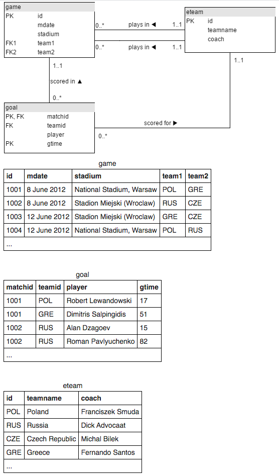
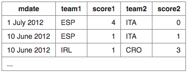

## 6. JOIN



1.Modify it to show the matchid and player name for all goals scored by Germany. To identify German players, check for: teamid = 'GER'
```sql
SELECT matchid, player FROM goal 
  WHERE teamid = 'GER';
```

2.From the previous query you can see that Lars Bender's scored a goal in game 1012. Now we want to know what teams were playing in that match.
Notice in the that the column matchid in the goal table corresponds to the id column in the game table. We can look up information about game 1012 by finding that row in the game table.
Show id, stadium, team1, team2 for just game 1012
```sql
SELECT id,stadium,team1,team2
  FROM game
WHERE id='1012';
```

3.You can combine the two steps into a single query with a JOIN.
```sql
SELECT *
  FROM game JOIN goal ON (id=matchid)
```
The FROM clause says to merge data from the goal table with that from the game table. The ON says how to figure out which rows in game go with which rows in goal - the matchid from goal must match id from game. (If we wanted to be more clear/specific we could say
ON (game.id=goal.matchid)

The code below shows the player (from the goal) and stadium name (from the game table) for every goal scored.

Modify it to show the player, teamid, stadium and mdate for every German goal.

```sql
SELECT player, teamid, stadium, mdate
  FROM game JOIN goal ON (game.id=goal.matchid)
WHERE goal.teamid='GER';
```

4.Use the same JOIN as in the previous question.
Show the team1, team2 and player for every goal scored by a player called Mario player LIKE 'Mario%'
```sql
SELECT team1, team2, player
  FROM game JOIN goal ON (game.id=goal.matchid)
WHERE goal.player LIKE 'Mario%';
```

5.The table ```eteam``` gives details of every national team including the coach. You can JOIN goal to eteam using the phrase ```goal JOIN eteam on teamid=id```
Show ```player```, ```teamid```, ```coach```, ```gtime``` for all goals scored in the first 10 minutes gtime<=10
```sql
SELECT player, teamid, coach, gtime
  FROM goal JOIN eteam ON (goal.teamid = eteam.id) 
 WHERE goal.gtime<=10;
```

6.To ```JOIN``` game with ```eteam``` you could use either ```game JOIN eteam ON (team1=eteam.id)``` or ```game JOIN eteam ON (team2=eteam.id)```
Notice that because ```id``` is a column name in both ```game``` and ```eteam``` you must specify ```eteam.id``` instead of just ```id```
List the dates of the matches and the name of the team in which 'Fernando Santos' was the team1 coach.
```sql
SELECT mdate, teamname
FROM game JOIN eteam ON (game.team1=eteam.id)
WHERE eteam.coach='Fernando Santos';
```

7.List the player for every goal scored in a game where the stadium was 'National Stadium, Warsaw'
```sql
SELECT player
FROM goal JOIN game ON (goal.matchid = game.id)
WHERE game.stadium = 'National Stadium, Warsaw';
```

8.The example query shows all goals scored in the Germany-Greece quarterfinal.
Instead show the name of all players who scored a goal against Germany.
```sql
SELECT DISTINCT player 
FROM game JOIN goal ON goal.matchid = game.id 
WHERE (game.team1 ='GER' OR game.team2 ='GER')
AND goal.teamid!='GER';
```

9.Show teamname and the total number of goals scored.
```sql
SELECT teamname, COUNT(gtime)
  FROM eteam JOIN goal ON (eteam.id=goal.teamid)
GROUP BY teamname;
```

10.Show the stadium and the number of goals scored in each stadium.
```sql
SELECT stadium, COUNT(id)
FROM game JOIN goal ON (game.id = goal.matchid)
GROUP BY game.stadium;
```

11.For every match involving 'POL', show the matchid, date and the number of goals scored.
```sql
SELECT matchid, mdate, COUNT(mdate)
FROM game JOIN goal ON matchid = id 
WHERE (team1 = 'POL' OR team2 = 'POL')
GROUP BY matchid, mdate;
```

12.For every match where 'GER' scored, show matchid, match date and the number of goals scored by 'GER'
```sql
SELECT matchid, mdate, COUNT(id)
FROM game JOIN goal ON (game.id = goal.matchid)
WHERE goal.teamid = 'GER'
GROUP BY matchid, mdate;
```

13.List every match with the goals scored by each team as shown. This will use "CASE WHEN" which has not been explained in any previous exercises.


Notice in the query given every goal is listed. If it was a team1 goal then a 1 appears in score1, otherwise there is a 0. You could SUM this column to get a count of the goals scored by team1. 
**Sort your result by mdate, matchid, team1 and team2.**
```sql
SELECT mdate, 
       team1, SUM(CASE WHEN teamid=team1 THEN 1 ELSE 0 END) AS score1,
       team2, SUM(CASE WHEN teamid=team2 THEN 1 ELSE 0 END) AS score2
FROM game LEFT JOIN goal ON matchid = id
GROUP BY mdate, team1, team2
ORDER BY mdate, matchid, team1, team2;
```