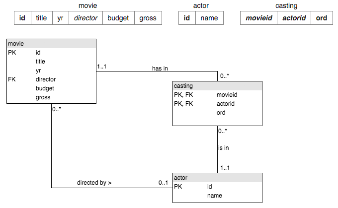

## 7. More JOIN Operations


1.List the films where the yr is 1962 [Show id, title]
```sql
SELECT id, title
 FROM movie
 WHERE yr=1962;
```

2.Give year of 'Citizen Kane'.
```sql
SELECT yr
FROM movie
WHERE title='Citizen Kane';
```

3.List all of the Star Trek movies, include the id, title and yr (all of these movies include the words Star Trek in the title). Order results by year.
```sql
SELECT id, title, yr
FROM movie
WHERE title LIKE CONCAT('Star Trek', '%')
ORDER BY yr;
```

4.What id number does the actor 'Glenn Close' have?
```sql
SELECT id
FROM actor
WHERE name = 'Glenn Close';
```

5.What is the id of the film 'Casablanca'
```sql
SELECT id
FROM movie
WHERE title = 'Casablanca';
```

6.Obtain the cast list for 'Casablanca'.
what is a cast list?
Use movieid=11768, (or whatever value you got from the previous question)
```sql
SELECT name 
FROM movie JOIN casting on movie.id = movieid 
           JOIN actor ON actor.id = actorid
WHERE movieid=11768;
```

7.Obtain the cast list for the film 'Alien'
```sql
SELECT name 
FROM movie JOIN casting on movie.id = movieid 
           JOIN actor ON actor.id = actorid
WHERE title='Alien';
```

8.List the films in which 'Harrison Ford' has appeared
```sql
SELECT title
FROM movie JOIN casting on movie.id = movieid 
           JOIN actor ON actor.id = actorid
WHERE actor.name='Harrison Ford';
```

9.List the films where 'Harrison Ford' has appeared - but not in the starring role. [Note: the ord field of casting gives the position of the actor. If ord=1 then this actor is in the starring role]
```sql
SELECT title
FROM movie JOIN casting on movie.id = movieid 
           JOIN actor ON actor.id = actorid
WHERE actor.name='Harrison Ford' AND casting.ord != 1;
```

10.List the films together with the leading star for all 1962 films.
```sql
SELECT title, name
FROM movie JOIN casting on movie.id = movieid 
           JOIN actor ON actor.id = actorid
WHERE yr=1962 AND ord = 1;
```

11.Which were the busiest years for 'Rock Hudson', show the year and the number of movies he made each year for any year in which he made more than 2 movies.
```sql
SELECT yr, COUNT(title) 
FROM movie JOIN casting ON movie.id=movieid
        JOIN actor   ON actorid=actor.id
WHERE name='Rock Hudson'
GROUP BY yr
HAVING COUNT(title) > 2;
```

12.List the film title and the leading actor for all of the films 'Julie Andrews' played in.
Did you get "Little Miss Marker twice"?
```sql
SELECT title, name
FROM movie JOIN casting ON (movieid = movie.id AND ord=1)
             JOIN actor ON (actorid = actor.id)
WHERE movie.id IN (SELECT movieid FROM casting 
WHERE actorid IN (
  SELECT id FROM actor
  WHERE name='Julie Andrews') );
```

13.Obtain a list, in alphabetical order, of actors who've had at least 15 starring roles.
```sql
SELECT name 
FROM (
  SELECT name, COUNT(movieid) AS total_starring_roles
  FROM movie JOIN casting ON (movieid = movie.id AND ord=1)
             JOIN actor ON (actorid = actor.id) 
  GROUP BY name) AS new_table
WHERE total_starring_roles > 14;
```

14.List the films released in the year 1978 ordered by the number of actors in the cast, then by title.
```sql
SELECT title, number_of_actors
FROM (
  SELECT movieid, COUNT(actorid) AS number_of_actors
  FROM casting
  GROUP BY movieid
) AS new_table JOIN movie ON (new_table.movieid = movie.id )
WHERE yr = 1978
ORDER BY number_of_actors DESC, title;
```

15.List all the people who have worked with 'Art Garfunkel'.
```sql
SELECT name
FROM casting JOIN actor ON (casting.actorid = actor.id)
             JOIN movie ON (casting.movieid = movie.id)
WHERE movieid IN (
  SELECT movieid
  FROM casting JOIN actor ON (casting.actorid = actor.id)
  WHERE name = 'Art Garfunkel') AND name != 'Art Garfunkel';
```