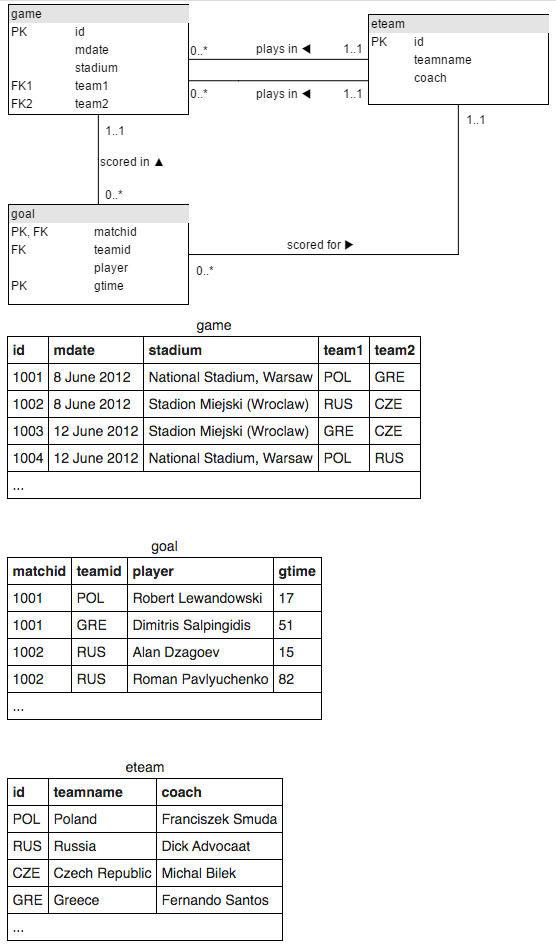
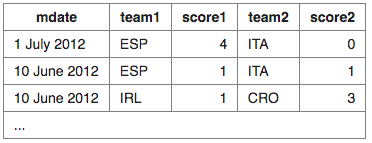

# sql-zoo
Microverse School > SQL Project > SQL Zoo

The goal of this project is to put into practice SQL queries using the online resource  [SQL Zoo](http://sqlzoo.net).

## Index

0. [SELECT Basics](#0-select-basics)
1. [SELECT Name](#1-select-name)
2. [SELECT From World](#2-select-from-world)
3. [SELECT From Nobel](#3-select-from-nobel)
4. [SELECT within SELECT Tutorial](#4-select-within-select-tutorial)
5. [SUM and COUNT](#5-sum-and-count)

## 0. SELECT Basics

1.Show the population of Germany.

```sql
SELECT population FROM world
WHERE name = 'Germany';
```

2.Show the name and the population for 'Sweden', 'Norway' and 'Denmark'.

```sql
SELECT name, population FROM world
WHERE name IN ('Sweden', 'Norway', 'Denmark');
```

3.Show the country and the area for countries with an area between 200,000
and 250,000.

```sql
SELECT name, area FROM world
WHERE area BETWEEN 200000 AND 250000;
```

## 1. SELECT Name

1.Find the country that start with Y
```sql
SELECT name FROM world
WHERE name LIKE 'Y%';
```

2.Find the countries that end with y
```sql
SELECT name FROM world
WHERE name LIKE '%y';
```

3.Find the countries that contain the letter x
```sql
SELECT name FROM world
WHERE name LIKE '%x%';
```

4.Find the countries that end with land
```sql
SELECT name FROM world
WHERE name LIKE '%land';
```

5.Find the countries that start with C and end with ia
```sql
SELECT name FROM world
WHERE name LIKE 'C%ia';
```

6.Find the country that has oo in the name
```sql
SELECT name FROM world
WHERE name LIKE '%oo%';
```

7.Find the countries that have three or more a in the name
```sql
SELECT name FROM world
WHERE name REGEXP '(.*[a]){3,}';
```

8.Find the countries that have "t" as the second character.
```sql
SELECT name FROM world
WHERE name LIKE '_t%'
ORDER BY name;
```

9.Find the countries that have two "o" characters separated by two others.
```sql
SELECT name FROM world
WHERE name LIKE '%o__o%';
```

10.Find the countries that have exactly four characters.
```sql
SELECT name FROM world
WHERE name LIKE '____';
```

11.Find the country where the name is the capital city.
```sql
SELECT name
FROM world
WHERE name LIKE capital;
```

12.Find the country where the capital is the country plus "City".
```sql
SELECT name
FROM world
WHERE capital LIKE concat(name, ' City');
```

13.Find the capital and the name where the capital includes the name of the country.
```sql
SELECT capital, name
FROM world
WHERE capital LIKE CONCAT(name, '%');
```

14.Find the capital and the name where the capital is an extension of name of the country.
You should include Mexico City as it is longer than Mexico. You should not include Luxembourg as the capital is the same as the country.
```sql
SELECT capital, name
FROM world
WHERE capital LIKE concat(name, '%') EXCEPT SELECT capital, name
FROM world WHERE capital LIKE name;
```

15.For Monaco-Ville the name is Monaco and the extension is -Ville.
Show the name and the extension where the capital is an extension of name of the country.
You can use the SQL function REPLACE.
```sql
SELECT name , REPLACE(capital,name,'')
FROM world
WHERE capital LIKE concat(name, '_%');
```

## 2. SELECT From World

1.Read the notes about this table. Observe the result of running this SQL command to show the name, continent and population of all countries.
```sql
SELECT name, continent, population FROM world;
````

2.How to use WHERE to filter records. Show the name for the countries that have a population of at least 200 million. 200 million is 200000000, there are eight zeros.
```sql
SELECT name FROM world
WHERE population > 200000000;
```

3.Give the name and the per capita GDP for those countries with a population of at least 200 million.
```sql
SELECT name, gdp/population
FROM world
WHERE population > 200000000;
```

4.Show the name and population in millions for the countries of the continent 'South America'. Divide the population by 1000000 to get population in millions.
```sql
SELECT name, population/1000000
FROM world
WHERE continent LIKE 'South America';
```

5.Show the name and population for France, Germany, Italy
```sql
SELECT name, population
FROM world
WHERE name IN ('France', 'Germany', 'Italy');
```

6.Show the countries which have a name that includes the word 'United'
```sql
SELECT name
FROM world
WHERE name LIKE CONCAT('United', '%');
```

7.Two ways to be big: A country is big if it has an area of more than 3 million sq km or it has a population of more than 250 million.
Show the countries that are big by area or big by population. Show name, population and area.
```sql
SELECT name, population, area
FROM world
WHERE population > 250000000 OR area > 3000000;
```

8.Exclusive OR (XOR). Show the countries that are big by area (more than 3 million) or big by population (more than 250 million) but not both. Show name, population and area.
Australia has a big area but a small population, it should be included.
Indonesia has a big population but a small area, it should be included.
China has a big population and big area, it should be excluded.
United Kingdom has a small population and a small area, it should be excluded.
```sql
SELECT name, population, area
FROM world
WHERE population > 250000000 XOR area > 3000000;
```

9.Show the name and population in millions and the GDP in billions for the countries of the continent 'South America'. Use the ROUND function to show the values to two decimal places.
For South America show population in millions and GDP in billions both to 2 decimal places.
Millions and billions
```sql
SELECT name, round(population/1000000, 2), round(gdp/1000000000, 2)
FROM world
WHERE continent LIKE 'South America';
```

10.Show the name and per-capita GDP for those countries with a GDP of at least one trillion (1000000000000; that is 12 zeros). Round this value to the nearest 1000.
Show per-capita GDP for the trillion dollar countries to the nearest $1000.
```sql
SELECT name, round(gdp/population, -3)
FROM world
WHERE gdp > 1000000000000;
```

11.Greece has capital Athens.
Each of the strings 'Greece', and 'Athens' has 6 characters.
Show the name and capital where the name and the capital have the same number of characters.
You can use the LENGTH function to find the number of characters in a string
```sql
SELECT name, capital
FROM world WHERE LENGTH(name) = LENGTH(capital);
```

12.The capital of Sweden is Stockholm. Both words start with the letter 'S'.
Show the name and the capital where the first letters of each match. Don't include countries where the name and the capital are the same word.
You can use the function LEFT to isolate the first character.
You can use <> as the NOT EQUALS operator.
```sql
SELECT name, capital
FROM world
WHERE LEFT(name,1) = LEFT(capital,1) EXCEPT SELECT name, capital
FROM world WHERE name = capital;
```

13.Equatorial Guinea and Dominican Republic have all of the vowels (a e i o u) in the name. They don't count because they have more than one word in the name.
Find the country that has all the vowels and no spaces in its name.
You can use the phrase name NOT LIKE '%a%' to exclude characters from your results.
The query shown misses countries like Bahamas and Belarus because they contain at least one 'a'
```sql
SELECT name
   FROM world
WHERE name LIKE '%a%' AND
      name LIKE '%e%' AND
      name LIKE '%i%' AND
      name LIKE '%o%' AND
      name LIKE '%u%' AND
      name NOT LIKE '% %';
```

## 3. SELECT From Nobel
1.Change the query shown so that it displays Nobel prizes for 1950.
```sql
SELECT yr, subject, winner
  FROM nobel
 WHERE yr = 1950;
```

2.Show who won the 1962 prize for Literature.
```sql
SELECT winner
  FROM nobel
 WHERE yr = 1962
   AND subject = 'Literature';
```

3.Show the year and subject that won 'Albert Einstein' his prize.
```sql
SELECT yr, subject
FROM nobel
WHERE winner LIKE 'Albert Einstein';
```

4.Give the name of the 'Peace' winners since the year 2000, including 2000.
```sql
SELECT winner
FROM nobel
WHERE subject='Peace' AND yr >= 2000;
```

5.Show all details (yr, subject, winner) of the Literature prize winners for 1980 to 1989 inclusive.
```sql
SELECT yr, subject, winner
FROM nobel
WHERE subject LIKE 'Literature' AND (yr >= 1980 AND yr <= 1989);
```

6.Show all details of the presidential winners:
Theodore Roosevelt
Woodrow Wilson
Jimmy Carter
Barack Obama
```sql
SELECT * FROM nobel
 WHERE winner IN ('Theodore Roosevelt',
                  'Woodrow Wilson',
                  'Jimmy Carter',
                  'Barack Obama');
```

7.Show the winners with first name John
```sql
SELECT winner
FROM nobel
WHERE winner LIKE 'John%';
```

8.Show the year, subject, and name of Physics winners for 1980 together with the Chemistry winners for 1984.
```sql
SELECT yr, subject, winner
FROM nobel
WHERE (subject LIKE 'Physics' AND yr=1980) OR (subject LIKE 'Chemistry' AND yr=1984);
```

9.Show the year, subject, and name of winners for 1980 excluding Chemistry and Medicine
```sql
SELECT yr, subject, winner
FROM nobel
WHERE yr=1980 AND subject NOT LIKE 'Chemistry' AND subject NOT LIKE 'Medicine';
```

10.Show year, subject, and name of people who won a 'Medicine' prize in an early
year (before 1910, not including 1910) together with winners of a 'Literature' prize
in a later year (after 2004, including 2004)
```sql
SELECT yr, subject, winner
FROM nobel
WHERE (subject LIKE 'Medicine' AND yr < 1910)
  OR (subject LIKE 'Literature' AND yr >= 2004);
```

11.Find all details of the prize won by PETER GRÜNBERG
```sql
SELECT *
FROM nobel
WHERE winner = CONCAT('PETER GR', CHAR(252), 'NBERG');
```

12.Find all details of the prize won by EUGENE O'NEILL
Escaping single quotes
```sql
SELECT *
FROM nobel
WHERE winner = concat('EUGENE O', CHR(39), 'NEILL');
```

13.Knights in order
List the winners, year and subject where the winner starts with Sir.
Show the the most recent first, then by name order.
```sql
SELECT winner, yr, subject
FROM nobel
WHERE winner LIKE 'Sir%' ORDER BY yr DESC, winner;
```

14.The expression subject IN ('Chemistry','Physics') can be used as a value - it will be 0 or 1.
Show the 1984 winners and subject ordered by subject and winner name; but list Chemistry and Physics last.
```sql
SELECT winner, subject
  FROM nobel
 WHERE yr=1984
 ORDER BY subject IN ('Physics','Chemistry'), subject, winner;
````

## 4. SELECT within SELECT Tutorial

1.List each country name where the population is larger than that of 'Russia'.
```sql
SELECT name FROM world
  WHERE population >
     (SELECT population FROM world
      WHERE name='Russia');
```

2.Show the countries in Europe with a per capita GDP greater than 'United Kingdom'.
```sql
SELECT name
FROM world
WHERE continent = 'Europe' AND gdp/population >(SELECT gdp/population FROM world WHERE name='United Kingdom');
```

3.List the name and continent of countries in the continents containing either Argentina or Australia. Order by name of the country.
```sql
SELECT name, continent
FROM world WHERE continent IN (SELECT continent FROM world WHERE name='Argentina' or name='Australia') ORDER BY name;
```

4.Which country has a population that is more than Canada but less than Poland? Show the name and the population.
```sql
SELECT name, population
FROM world
WHERE population > (SELECT population FROM world WHERE name='Canada') AND population < (SELECT population FROM world WHERE name='Poland');
```

5.Germany (population 80 million) has the largest population of the countries in Europe. Austria (population 8.5 million) has 11% of the population of Germany.
Show the name and the population of each country in Europe. Show the population as a percentage of the population of Germany.
```sql
SELECT name, CONCAT(round(100*population/(SELECT population FROM world WHERE name='Germany'),0),'%')
FROM world
WHERE continent='Europe';
```

6.Which countries have a GDP greater than every country in Europe? [Give the name only.] (Some countries may have NULL gdp values)
```sql
SELECT name
FROM world
WHERE gdp > (SELECT MAX(gdp) FROM world WHERE continent='Europe');
```

7.Find the largest country (by area) in each continent, show the continent, the name and the area:
```sql
SELECT continent, name, area 
FROM world AS x
WHERE x.area >= 
  (SELECT MAX(area) FROM world y
      WHERE y.continent=x.continent);
```

8.List each continent and the name of the country that comes first alphabetically.
```sql
SELECT continent, name
FROM world AS x
WHERE x.name = 
  (SELECT name FROM world y
      WHERE y.continent=x.continent ORDER BY name LIMIT 1);
```

9.Find the continents where all countries have a population <= 25000000. 
Then find the names of the countries associated with these continents. Show name, continent and population.
```sql
SELECT name, continent, population
FROM world AS x
WHERE 25000000 > ALL (
  SELECT y.population
  FROM world AS y
  WHERE x.continent = y.continent);
```

10.Some countries have populations more than three times that of any of their neighbours 
(in the same continent). Give the countries and continents.
```sql
SELECT name, continent
FROM world AS x
WHERE x.population/3 > ALL (
  SELECT y.population
  FROM world AS y
  WHERE x.continent = y.continent
  AND x.name != y.name);
```

## 5. SUM and COUNT
1.Show the total population of the world.
```sql
SELECT SUM(population)
FROM world;
```

2.List all the continents - just once each.
```sql
SELECT DISTINCT continent
FROM world;
```

3.Give the total GDP of Africa
```sql
SELECT SUM(gdp)
FROM world
WHERE continent ='Africa';
```

4.How many countries have an area of at least 1000000
```sql
SELECT COUNT(name)
FROM world
WHERE area > 1000000;
```

5.What is the total population of ('Estonia', 'Latvia', 'Lithuania')
```sql
SELECT SUM(population)
FROM world
WHERE name IN ('Estonia', 'Latvia', 'Lithuania');
```

6.For each continent show the continent and number of countries.
```sql
SELECT continent, COUNT(name)
FROM world
GROUP BY continent;
```

7.For each continent show the continent and number of countries with populations of at least 10 million.
```sql
SELECT continent, COUNT(name)
FROM world
WHERE population > 10000000 
GROUP BY continent;
```

8.List the continents that have a total population of at least 100 million.
```sql
SELECT continent
FROM (SELECT continent, SUM(population) AS total_population FROM world GROUP BY CONTINENT) AS X
WHERE X.total_population > 100000000;
```

## 6. JOIN



1.Modify it to show the matchid and player name for all goals scored by Germany. To identify German players, check for: teamid = 'GER'
```sql
SELECT matchid, player FROM goal 
  WHERE teamid = 'GER';
```

2.From the previous query you can see that Lars Bender's scored a goal in game 1012. Now we want to know what teams were playing in that match.
Notice in the that the column matchid in the goal table corresponds to the id column in the game table. We can look up information about game 1012 by finding that row in the game table.
Show id, stadium, team1, team2 for just game 1012
```sql
SELECT id,stadium,team1,team2
  FROM game
WHERE id='1012';
```

3.You can combine the two steps into a single query with a JOIN.
```sql
SELECT *
  FROM game JOIN goal ON (id=matchid)
```
The FROM clause says to merge data from the goal table with that from the game table. The ON says how to figure out which rows in game go with which rows in goal - the matchid from goal must match id from game. (If we wanted to be more clear/specific we could say
ON (game.id=goal.matchid)

The code below shows the player (from the goal) and stadium name (from the game table) for every goal scored.

Modify it to show the player, teamid, stadium and mdate for every German goal.

```sql
SELECT player, teamid, stadium, mdate
  FROM game JOIN goal ON (game.id=goal.matchid)
WHERE goal.teamid='GER';
```

4.Use the same JOIN as in the previous question.
Show the team1, team2 and player for every goal scored by a player called Mario player LIKE 'Mario%'
```sql
SELECT team1, team2, player
  FROM game JOIN goal ON (game.id=goal.matchid)
WHERE goal.player LIKE 'Mario%';
```

5.The table ```eteam``` gives details of every national team including the coach. You can JOIN goal to eteam using the phrase ```goal JOIN eteam on teamid=id```
Show ```player```, ```teamid```, ```coach```, ```gtime``` for all goals scored in the first 10 minutes gtime<=10
```sql
SELECT player, teamid, coach, gtime
  FROM goal JOIN eteam ON (goal.teamid = eteam.id) 
 WHERE goal.gtime<=10;
```

6.To ```JOIN``` game with ```eteam``` you could use either ```game JOIN eteam ON (team1=eteam.id)``` or ```game JOIN eteam ON (team2=eteam.id)```
Notice that because ```id``` is a column name in both ```game``` and ```eteam``` you must specify ```eteam.id``` instead of just ```id```
List the dates of the matches and the name of the team in which 'Fernando Santos' was the team1 coach.
```sql
SELECT mdate, teamname
FROM game JOIN eteam ON (game.team1=eteam.id)
WHERE eteam.coach='Fernando Santos';
```

7.List the player for every goal scored in a game where the stadium was 'National Stadium, Warsaw'
```sql
SELECT player
FROM goal JOIN game ON (goal.matchid = game.id)
WHERE game.stadium = 'National Stadium, Warsaw';
```

8.The example query shows all goals scored in the Germany-Greece quarterfinal.
Instead show the name of all players who scored a goal against Germany.
```sql
SELECT DISTINCT player 
FROM game JOIN goal ON goal.matchid = game.id 
WHERE (game.team1 ='GER' OR game.team2 ='GER')
AND goal.teamid!='GER';
```

9.Show teamname and the total number of goals scored.
```sql
SELECT teamname, COUNT(gtime)
  FROM eteam JOIN goal ON (eteam.id=goal.teamid)
GROUP BY teamname;
```

10.Show the stadium and the number of goals scored in each stadium.
```sql
SELECT stadium, COUNT(id)
FROM game JOIN goal ON (game.id = goal.matchid)
GROUP BY game.stadium;
```

11.For every match involving 'POL', show the matchid, date and the number of goals scored.
```sql
SELECT matchid, mdate, COUNT(mdate)
FROM game JOIN goal ON matchid = id 
WHERE (team1 = 'POL' OR team2 = 'POL')
GROUP BY matchid, mdate;
```

12.For every match where 'GER' scored, show matchid, match date and the number of goals scored by 'GER'
```sql
SELECT matchid, mdate, COUNT(id)
FROM game JOIN goal ON (game.id = goal.matchid)
WHERE goal.teamid = 'GER'
GROUP BY matchid, mdate;
```

13.List every match with the goals scored by each team as shown. This will use "CASE WHEN" which has not been explained in any previous exercises.


Notice in the query given every goal is listed. If it was a team1 goal then a 1 appears in score1, otherwise there is a 0. You could SUM this column to get a count of the goals scored by team1. 
**Sort your result by mdate, matchid, team1 and team2.**
```sql
SELECT mdate, 
       team1, SUM(CASE WHEN teamid=team1 THEN 1 ELSE 0 END) AS score1,
       team2, SUM(CASE WHEN teamid=team2 THEN 1 ELSE 0 END) AS score2
FROM game LEFT JOIN goal ON matchid = id
GROUP BY mdate, team1, team2
ORDER BY mdate, matchid, team1, team2;
```
