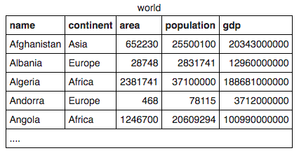
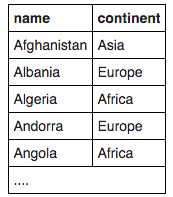
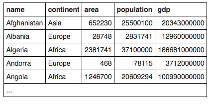
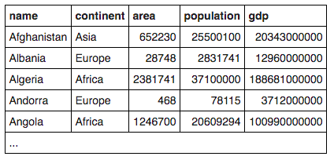
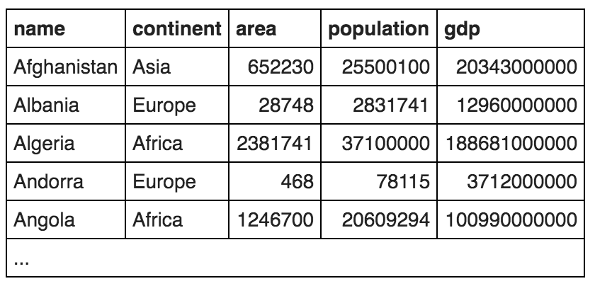
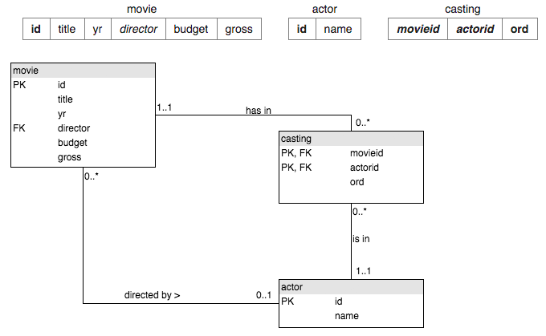
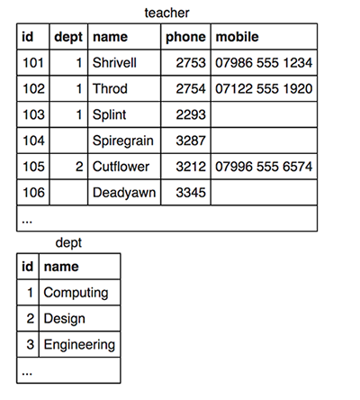
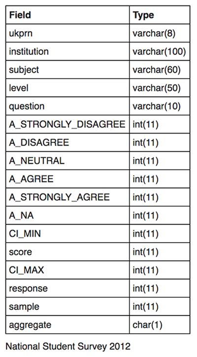

# sql-zoo
Microverse School > SQL Project > SQL Zoo

The goal of this project is to put into practice SQL queries using the online resource  [SQL Zoo](http://sqlzoo.net).

## Index

0. [SELECT Basics](#0-select-basics)
1. [SELECT Name](#1-select-name)
2. [SELECT From World](#2-select-from-world)
3. [SELECT From Nobel](#3-select-from-nobel)
4. [SELECT within SELECT Tutorial](#4-select-within-select-tutorial)
5. [SUM and COUNT](#5-sum-and-count)
6. [JOIN](#6-join)
6. [JOIN](JOIN/)
7. [More JOIN Operations](#7-more-join-operations)
8. [Using Null](#8-using-null)
9. [Numberic_Examples](#9-numeric-examples)

## 0. SELECT Basics



1.Show the population of Germany.

```sql
SELECT population FROM world
WHERE name = 'Germany';
```

2.Show the name and the population for 'Sweden', 'Norway' and 'Denmark'.

```sql
SELECT name, population FROM world
WHERE name IN ('Sweden', 'Norway', 'Denmark');
```

3.Show the country and the area for countries with an area between 200,000
and 250,000.

```sql
SELECT name, area FROM world
WHERE area BETWEEN 200000 AND 250000;
```

## 1. SELECT Name


1.Find the country that start with Y
```sql
SELECT name FROM world
WHERE name LIKE 'Y%';
```

2.Find the countries that end with y
```sql
SELECT name FROM world
WHERE name LIKE '%y';
```

3.Find the countries that contain the letter x
```sql
SELECT name FROM world
WHERE name LIKE '%x%';
```

4.Find the countries that end with land
```sql
SELECT name FROM world
WHERE name LIKE '%land';
```

5.Find the countries that start with C and end with ia
```sql
SELECT name FROM world
WHERE name LIKE 'C%ia';
```

6.Find the country that has oo in the name
```sql
SELECT name FROM world
WHERE name LIKE '%oo%';
```

7.Find the countries that have three or more a in the name
```sql
SELECT name FROM world
WHERE name REGEXP '(.*[a]){3,}';
```

8.Find the countries that have "t" as the second character.
```sql
SELECT name FROM world
WHERE name LIKE '_t%'
ORDER BY name;
```

9.Find the countries that have two "o" characters separated by two others.
```sql
SELECT name FROM world
WHERE name LIKE '%o__o%';
```

10.Find the countries that have exactly four characters.
```sql
SELECT name FROM world
WHERE name LIKE '____';
```

11.Find the country where the name is the capital city.
```sql
SELECT name
FROM world
WHERE name LIKE capital;
```

12.Find the country where the capital is the country plus "City".
```sql
SELECT name
FROM world
WHERE capital LIKE concat(name, ' City');
```

13.Find the capital and the name where the capital includes the name of the country.
```sql
SELECT capital, name
FROM world
WHERE capital LIKE CONCAT(name, '%');
```

14.Find the capital and the name where the capital is an extension of name of the country.
You should include Mexico City as it is longer than Mexico. You should not include Luxembourg as the capital is the same as the country.
```sql
SELECT capital, name
FROM world
WHERE capital LIKE concat(name, '%') EXCEPT SELECT capital, name
FROM world WHERE capital LIKE name;
```

15.For Monaco-Ville the name is Monaco and the extension is -Ville.
Show the name and the extension where the capital is an extension of name of the country.
You can use the SQL function REPLACE.
```sql
SELECT name , REPLACE(capital,name,'')
FROM world
WHERE capital LIKE concat(name, '_%');
```

## 2. SELECT From World


1.Read the notes about this table. Observe the result of running this SQL command to show the name, continent and population of all countries.
```sql
SELECT name, continent, population FROM world;
````

2.How to use WHERE to filter records. Show the name for the countries that have a population of at least 200 million. 200 million is 200000000, there are eight zeros.
```sql
SELECT name FROM world
WHERE population > 200000000;
```

3.Give the name and the per capita GDP for those countries with a population of at least 200 million.
```sql
SELECT name, gdp/population
FROM world
WHERE population > 200000000;
```

4.Show the name and population in millions for the countries of the continent 'South America'. Divide the population by 1000000 to get population in millions.
```sql
SELECT name, population/1000000
FROM world
WHERE continent LIKE 'South America';
```

5.Show the name and population for France, Germany, Italy
```sql
SELECT name, population
FROM world
WHERE name IN ('France', 'Germany', 'Italy');
```

6.Show the countries which have a name that includes the word 'United'
```sql
SELECT name
FROM world
WHERE name LIKE CONCAT('United', '%');
```

7.Two ways to be big: A country is big if it has an area of more than 3 million sq km or it has a population of more than 250 million.
Show the countries that are big by area or big by population. Show name, population and area.
```sql
SELECT name, population, area
FROM world
WHERE population > 250000000 OR area > 3000000;
```

8.Exclusive OR (XOR). Show the countries that are big by area (more than 3 million) or big by population (more than 250 million) but not both. Show name, population and area.
Australia has a big area but a small population, it should be included.
Indonesia has a big population but a small area, it should be included.
China has a big population and big area, it should be excluded.
United Kingdom has a small population and a small area, it should be excluded.
```sql
SELECT name, population, area
FROM world
WHERE population > 250000000 XOR area > 3000000;
```

9.Show the name and population in millions and the GDP in billions for the countries of the continent 'South America'. Use the ROUND function to show the values to two decimal places.
For South America show population in millions and GDP in billions both to 2 decimal places.
Millions and billions
```sql
SELECT name, round(population/1000000, 2), round(gdp/1000000000, 2)
FROM world
WHERE continent LIKE 'South America';
```

10.Show the name and per-capita GDP for those countries with a GDP of at least one trillion (1000000000000; that is 12 zeros). Round this value to the nearest 1000.
Show per-capita GDP for the trillion dollar countries to the nearest $1000.
```sql
SELECT name, round(gdp/population, -3)
FROM world
WHERE gdp > 1000000000000;
```

11.Greece has capital Athens.
Each of the strings 'Greece', and 'Athens' has 6 characters.
Show the name and capital where the name and the capital have the same number of characters.
You can use the LENGTH function to find the number of characters in a string
```sql
SELECT name, capital
FROM world WHERE LENGTH(name) = LENGTH(capital);
```

12.The capital of Sweden is Stockholm. Both words start with the letter 'S'.
Show the name and the capital where the first letters of each match. Don't include countries where the name and the capital are the same word.
You can use the function LEFT to isolate the first character.
You can use <> as the NOT EQUALS operator.
```sql
SELECT name, capital
FROM world
WHERE LEFT(name,1) = LEFT(capital,1) EXCEPT SELECT name, capital
FROM world WHERE name = capital;
```

13.Equatorial Guinea and Dominican Republic have all of the vowels (a e i o u) in the name. They don't count because they have more than one word in the name.
Find the country that has all the vowels and no spaces in its name.
You can use the phrase name NOT LIKE '%a%' to exclude characters from your results.
The query shown misses countries like Bahamas and Belarus because they contain at least one 'a'
```sql
SELECT name
   FROM world
WHERE name LIKE '%a%' AND
      name LIKE '%e%' AND
      name LIKE '%i%' AND
      name LIKE '%o%' AND
      name LIKE '%u%' AND
      name NOT LIKE '% %';
```

## 3. SELECT From Nobel


1.Change the query shown so that it displays Nobel prizes for 1950.
```sql
SELECT yr, subject, winner
  FROM nobel
 WHERE yr = 1950;
```

2.Show who won the 1962 prize for Literature.
```sql
SELECT winner
  FROM nobel
 WHERE yr = 1962
   AND subject = 'Literature';
```

3.Show the year and subject that won 'Albert Einstein' his prize.
```sql
SELECT yr, subject
FROM nobel
WHERE winner LIKE 'Albert Einstein';
```

4.Give the name of the 'Peace' winners since the year 2000, including 2000.
```sql
SELECT winner
FROM nobel
WHERE subject='Peace' AND yr >= 2000;
```

5.Show all details (yr, subject, winner) of the Literature prize winners for 1980 to 1989 inclusive.
```sql
SELECT yr, subject, winner
FROM nobel
WHERE subject LIKE 'Literature' AND (yr >= 1980 AND yr <= 1989);
```

6.Show all details of the presidential winners:
Theodore Roosevelt
Woodrow Wilson
Jimmy Carter
Barack Obama
```sql
SELECT * FROM nobel
 WHERE winner IN ('Theodore Roosevelt',
                  'Woodrow Wilson',
                  'Jimmy Carter',
                  'Barack Obama');
```

7.Show the winners with first name John
```sql
SELECT winner
FROM nobel
WHERE winner LIKE 'John%';
```

8.Show the year, subject, and name of Physics winners for 1980 together with the Chemistry winners for 1984.
```sql
SELECT yr, subject, winner
FROM nobel
WHERE (subject LIKE 'Physics' AND yr=1980) OR (subject LIKE 'Chemistry' AND yr=1984);
```

9.Show the year, subject, and name of winners for 1980 excluding Chemistry and Medicine
```sql
SELECT yr, subject, winner
FROM nobel
WHERE yr=1980 AND subject NOT LIKE 'Chemistry' AND subject NOT LIKE 'Medicine';
```

10.Show year, subject, and name of people who won a 'Medicine' prize in an early
year (before 1910, not including 1910) together with winners of a 'Literature' prize
in a later year (after 2004, including 2004)
```sql
SELECT yr, subject, winner
FROM nobel
WHERE (subject LIKE 'Medicine' AND yr < 1910)
  OR (subject LIKE 'Literature' AND yr >= 2004);
```

11.Find all details of the prize won by PETER GRÜNBERG
```sql
SELECT *
FROM nobel
WHERE winner = CONCAT('PETER GR', CHAR(252), 'NBERG');
```

12.Find all details of the prize won by EUGENE O'NEILL
Escaping single quotes
```sql
SELECT *
FROM nobel
WHERE winner = concat('EUGENE O', CHR(39), 'NEILL');
```

13.Knights in order
List the winners, year and subject where the winner starts with Sir.
Show the the most recent first, then by name order.
```sql
SELECT winner, yr, subject
FROM nobel
WHERE winner LIKE 'Sir%' ORDER BY yr DESC, winner;
```

14.The expression subject IN ('Chemistry','Physics') can be used as a value - it will be 0 or 1.
Show the 1984 winners and subject ordered by subject and winner name; but list Chemistry and Physics last.
```sql
SELECT winner, subject
  FROM nobel
 WHERE yr=1984
 ORDER BY subject IN ('Physics','Chemistry'), subject, winner;
````

## 4. SELECT within SELECT Tutorial


1.List each country name where the population is larger than that of 'Russia'.
```sql
SELECT name FROM world
  WHERE population >
     (SELECT population FROM world
      WHERE name='Russia');
```

2.Show the countries in Europe with a per capita GDP greater than 'United Kingdom'.
```sql
SELECT name
FROM world
WHERE continent = 'Europe' AND gdp/population >(SELECT gdp/population FROM world WHERE name='United Kingdom');
```

3.List the name and continent of countries in the continents containing either Argentina or Australia. Order by name of the country.
```sql
SELECT name, continent
FROM world WHERE continent IN (SELECT continent FROM world WHERE name='Argentina' or name='Australia') ORDER BY name;
```

4.Which country has a population that is more than Canada but less than Poland? Show the name and the population.
```sql
SELECT name, population
FROM world
WHERE population > (SELECT population FROM world WHERE name='Canada') AND population < (SELECT population FROM world WHERE name='Poland');
```

5.Germany (population 80 million) has the largest population of the countries in Europe. Austria (population 8.5 million) has 11% of the population of Germany.
Show the name and the population of each country in Europe. Show the population as a percentage of the population of Germany.
```sql
SELECT name, CONCAT(round(100*population/(SELECT population FROM world WHERE name='Germany'),0),'%')
FROM world
WHERE continent='Europe';
```

6.Which countries have a GDP greater than every country in Europe? [Give the name only.] (Some countries may have NULL gdp values)
```sql
SELECT name
FROM world
WHERE gdp > (SELECT MAX(gdp) FROM world WHERE continent='Europe');
```

7.Find the largest country (by area) in each continent, show the continent, the name and the area:
```sql
SELECT continent, name, area 
FROM world AS x
WHERE x.area >= 
  (SELECT MAX(area) FROM world y
      WHERE y.continent=x.continent);
```

8.List each continent and the name of the country that comes first alphabetically.
```sql
SELECT continent, name
FROM world AS x
WHERE x.name = 
  (SELECT name FROM world y
      WHERE y.continent=x.continent ORDER BY name LIMIT 1);
```

9.Find the continents where all countries have a population <= 25000000. 
Then find the names of the countries associated with these continents. Show name, continent and population.
```sql
SELECT name, continent, population
FROM world AS x
WHERE 25000000 > ALL (
  SELECT y.population
  FROM world AS y
  WHERE x.continent = y.continent);
```

10.Some countries have populations more than three times that of any of their neighbours 
(in the same continent). Give the countries and continents.
```sql
SELECT name, continent
FROM world AS x
WHERE x.population/3 > ALL (
  SELECT y.population
  FROM world AS y
  WHERE x.continent = y.continent
  AND x.name != y.name);
```

## 5. SUM and COUNT


1.Show the total population of the world.
```sql
SELECT SUM(population)
FROM world;
```

2.List all the continents - just once each.
```sql
SELECT DISTINCT continent
FROM world;
```

3.Give the total GDP of Africa
```sql
SELECT SUM(gdp)
FROM world
WHERE continent ='Africa';
```

4.How many countries have an area of at least 1000000
```sql
SELECT COUNT(name)
FROM world
WHERE area > 1000000;
```

5.What is the total population of ('Estonia', 'Latvia', 'Lithuania')
```sql
SELECT SUM(population)
FROM world
WHERE name IN ('Estonia', 'Latvia', 'Lithuania');
```

6.For each continent show the continent and number of countries.
```sql
SELECT continent, COUNT(name)
FROM world
GROUP BY continent;
```

7.For each continent show the continent and number of countries with populations of at least 10 million.
```sql
SELECT continent, COUNT(name)
FROM world
WHERE population > 10000000 
GROUP BY continent;
```

8.List the continents that have a total population of at least 100 million.
```sql
SELECT continent
FROM (SELECT continent, SUM(population) AS total_population FROM world GROUP BY CONTINENT) AS X
WHERE X.total_population > 100000000;
```


## 7. More JOIN Operations


1.List the films where the yr is 1962 [Show id, title]
```sql
SELECT id, title
 FROM movie
 WHERE yr=1962;
```

2.Give year of 'Citizen Kane'.
```sql
SELECT yr
FROM movie
WHERE title='Citizen Kane';
```

3.List all of the Star Trek movies, include the id, title and yr (all of these movies include the words Star Trek in the title). Order results by year.
```sql
SELECT id, title, yr
FROM movie
WHERE title LIKE CONCAT('Star Trek', '%')
ORDER BY yr;
```

4.What id number does the actor 'Glenn Close' have?
```sql
SELECT id
FROM actor
WHERE name = 'Glenn Close';
```

5.What is the id of the film 'Casablanca'
```sql
SELECT id
FROM movie
WHERE title = 'Casablanca';
```

6.Obtain the cast list for 'Casablanca'.
what is a cast list?
Use movieid=11768, (or whatever value you got from the previous question)
```sql
SELECT name 
FROM movie JOIN casting on movie.id = movieid 
           JOIN actor ON actor.id = actorid
WHERE movieid=11768;
```

7.Obtain the cast list for the film 'Alien'
```sql
SELECT name 
FROM movie JOIN casting on movie.id = movieid 
           JOIN actor ON actor.id = actorid
WHERE title='Alien';
```

8.List the films in which 'Harrison Ford' has appeared
```sql
SELECT title
FROM movie JOIN casting on movie.id = movieid 
           JOIN actor ON actor.id = actorid
WHERE actor.name='Harrison Ford';
```

9.List the films where 'Harrison Ford' has appeared - but not in the starring role. [Note: the ord field of casting gives the position of the actor. If ord=1 then this actor is in the starring role]
```sql
SELECT title
FROM movie JOIN casting on movie.id = movieid 
           JOIN actor ON actor.id = actorid
WHERE actor.name='Harrison Ford' AND casting.ord != 1;
```

10.List the films together with the leading star for all 1962 films.
```sql
SELECT title, name
FROM movie JOIN casting on movie.id = movieid 
           JOIN actor ON actor.id = actorid
WHERE yr=1962 AND ord = 1;
```

11.Which were the busiest years for 'Rock Hudson', show the year and the number of movies he made each year for any year in which he made more than 2 movies.
```sql
SELECT yr, COUNT(title) 
FROM movie JOIN casting ON movie.id=movieid
        JOIN actor   ON actorid=actor.id
WHERE name='Rock Hudson'
GROUP BY yr
HAVING COUNT(title) > 2;
```

12.List the film title and the leading actor for all of the films 'Julie Andrews' played in.
Did you get "Little Miss Marker twice"?
```sql
SELECT title, name
FROM movie JOIN casting ON (movieid = movie.id AND ord=1)
             JOIN actor ON (actorid = actor.id)
WHERE movie.id IN (SELECT movieid FROM casting 
WHERE actorid IN (
  SELECT id FROM actor
  WHERE name='Julie Andrews') );
```

13.Obtain a list, in alphabetical order, of actors who've had at least 15 starring roles.
```sql
SELECT name 
FROM (
  SELECT name, COUNT(movieid) AS total_starring_roles
  FROM movie JOIN casting ON (movieid = movie.id AND ord=1)
             JOIN actor ON (actorid = actor.id) 
  GROUP BY name) AS new_table
WHERE total_starring_roles > 14;
```

14.List the films released in the year 1978 ordered by the number of actors in the cast, then by title.
```sql
SELECT title, number_of_actors
FROM (
  SELECT movieid, COUNT(actorid) AS number_of_actors
  FROM casting
  GROUP BY movieid
) AS new_table JOIN movie ON (new_table.movieid = movie.id )
WHERE yr = 1978
ORDER BY number_of_actors DESC, title;
```

15.List all the people who have worked with 'Art Garfunkel'.
```sql
SELECT name
FROM casting JOIN actor ON (casting.actorid = actor.id)
             JOIN movie ON (casting.movieid = movie.id)
WHERE movieid IN (
  SELECT movieid
  FROM casting JOIN actor ON (casting.actorid = actor.id)
  WHERE name = 'Art Garfunkel') AND name != 'Art Garfunkel';
```

## 8. Using Null


1.List the teachers who have NULL for their department.
```sql
SELECT name
FROM teacher
WHERE dept IS NULL;
```

2.Note the INNER JOIN misses the teachers with no department and the departments with no teacher.
```sql
SELECT teacher.name, dept.name
 FROM teacher INNER JOIN dept
           ON (teacher.dept=dept.id);
```

3.Use a different JOIN so that all teachers are listed.
```sql
SELECT teacher.name, dept.name
FROM teacher LEFT JOIN dept ON ( teacher.dept = dept.id );
```

4.Use a different JOIN so that all departments are listed.
```sql
SELECT teacher.name, dept.name
FROM teacher RIGHT JOIN dept ON ( teacher.dept = dept.id );
```

5.Use COALESCE to print the mobile number. Use the number '07986 444 2266' if there is no number given. 
Show teacher name and mobile number or '07986 444 2266'
```sql
SELECT name, COALESCE(mobile, '07986 444 2266')
FROM teacher;
```

6.Use the COALESCE function and a LEFT JOIN to print the teacher name and department name. 
Use the string 'None' where there is no department.
```sql
SELECT teacher.name, COALESCE(dept.name, 'None') 
FROM teacher LEFT JOIN dept ON ( teacher.dept = dept.id );
```

7.Use COUNT to show the number of teachers and the number of mobile phones.
```sql
SELECT COUNT(id), COUNT(mobile)
FROM teacher
GROUP BY '';
```

8.Use COUNT and GROUP BY dept.name to show each department and the number of staff. 
Use a RIGHT JOIN to ensure that the Engineering department is listed.
```sql
SELECT dept.name, COUNT(teacher.name)
FROM teacher RIGHT JOIN dept ON ( dept.id = teacher.dept )
GROUP BY dept.name;
```

9.Use CASE to show the name of each teacher followed by 'Sci' if the teacher is in dept 1 or 2 and 'Art' otherwise.
```sql
SELECT name,
       CASE
           WHEN dept = 1 OR dept = 2 THEN 'Sci'
           ELSE 'Art'
       END
FROM teacher;
```

10.Use CASE to show the name of each teacher followed by 'Sci' if the teacher is in dept 1 or 2, 
show 'Art' if the teacher's dept is 3 and 'None' otherwise.
```sql
SELECT name,
       CASE
           WHEN dept = 1 OR dept = 2 THEN 'Sci'
           WHEN dept = 3 THEN 'Art'
           ELSE 'None'
       END
FROM teacher;
```

## 9. Numeric Examples


1.The example shows the number who responded for:

- question 1
- at 'Edinburgh Napier University'
- studying '(8) Computer Science'
Show the the percentage who STRONGLY AGREE

```sql

```