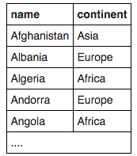

## 1. SELECT Name


1.Find the country that start with Y
```sql
SELECT name FROM world
WHERE name LIKE 'Y%';
```

2.Find the countries that end with y
```sql
SELECT name FROM world
WHERE name LIKE '%y';
```

3.Find the countries that contain the letter x
```sql
SELECT name FROM world
WHERE name LIKE '%x%';
```

4.Find the countries that end with land
```sql
SELECT name FROM world
WHERE name LIKE '%land';
```

5.Find the countries that start with C and end with ia
```sql
SELECT name FROM world
WHERE name LIKE 'C%ia';
```

6.Find the country that has oo in the name
```sql
SELECT name FROM world
WHERE name LIKE '%oo%';
```

7.Find the countries that have three or more a in the name
```sql
SELECT name FROM world
WHERE name REGEXP '(.*[a]){3,}';
```

8.Find the countries that have "t" as the second character.
```sql
SELECT name FROM world
WHERE name LIKE '_t%'
ORDER BY name;
```

9.Find the countries that have two "o" characters separated by two others.
```sql
SELECT name FROM world
WHERE name LIKE '%o__o%';
```

10.Find the countries that have exactly four characters.
```sql
SELECT name FROM world
WHERE name LIKE '____';
```

11.Find the country where the name is the capital city.
```sql
SELECT name
FROM world
WHERE name LIKE capital;
```

12.Find the country where the capital is the country plus "City".
```sql
SELECT name
FROM world
WHERE capital LIKE concat(name, ' City');
```

13.Find the capital and the name where the capital includes the name of the country.
```sql
SELECT capital, name
FROM world
WHERE capital LIKE CONCAT(name, '%');
```

14.Find the capital and the name where the capital is an extension of name of the country.
You should include Mexico City as it is longer than Mexico. You should not include Luxembourg as the capital is the same as the country.
```sql
SELECT capital, name
FROM world
WHERE capital LIKE concat(name, '%') EXCEPT SELECT capital, name
FROM world WHERE capital LIKE name;
```

15.For Monaco-Ville the name is Monaco and the extension is -Ville.
Show the name and the extension where the capital is an extension of name of the country.
You can use the SQL function REPLACE.
```sql
SELECT name , REPLACE(capital,name,'')
FROM world
WHERE capital LIKE concat(name, '_%');
```