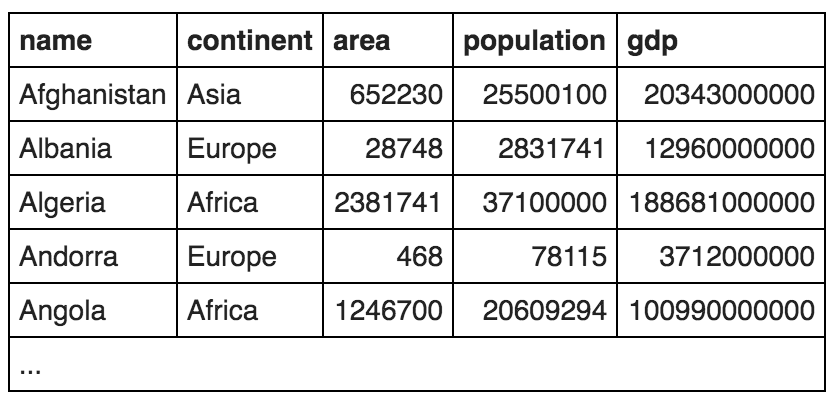

## 5. SUM and COUNT


1.Show the total population of the world.
```sql
SELECT SUM(population)
FROM world;
```

2.List all the continents - just once each.
```sql
SELECT DISTINCT continent
FROM world;
```

3.Give the total GDP of Africa
```sql
SELECT SUM(gdp)
FROM world
WHERE continent ='Africa';
```

4.How many countries have an area of at least 1000000
```sql
SELECT COUNT(name)
FROM world
WHERE area > 1000000;
```

5.What is the total population of ('Estonia', 'Latvia', 'Lithuania')
```sql
SELECT SUM(population)
FROM world
WHERE name IN ('Estonia', 'Latvia', 'Lithuania');
```

6.For each continent show the continent and number of countries.
```sql
SELECT continent, COUNT(name)
FROM world
GROUP BY continent;
```

7.For each continent show the continent and number of countries with populations of at least 10 million.
```sql
SELECT continent, COUNT(name)
FROM world
WHERE population > 10000000 
GROUP BY continent;
```

8.List the continents that have a total population of at least 100 million.
```sql
SELECT continent
FROM (SELECT continent, SUM(population) AS total_population FROM world GROUP BY CONTINENT) AS X
WHERE X.total_population > 100000000;
```