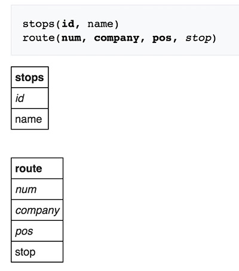

## 11. Self join


1.How many stops are in the database.

```sql
SELECT COUNT(*) FROM stops;

```

2.Find the id value for the stop 'Craiglockhart'

```sql
SELECT id from stops WHERE name='Craiglockhart';
```


3.Give the id and the name for the stops on the '4' 'LRT' service.

```sql
SELECT id, name
FROM stops
JOIN route ON stops.id = route.stop
WHERE num = 4
AND company = 'LRT';
```

4.The query shown gives the number of routes that visit either London Road (149) or Craiglockhart (53). Run the query and notice the two services that link these stops have a count of 2. Add a HAVING clause to restrict the output to these two routes.

```sql
SELECT company, num, COUNT(*)
FROM route WHERE stop=149 OR stop=53
GROUP BY company, num
HAVING COUNT(*) = 2;
```

5.Execute the self join shown and observe that b.stop gives all the places you can get to from Craiglockhart, without changing routes. Change the query so that it shows the services from Craiglockhart to London Road.

```sql
SELECT a.company, a.num, a.stop, b.stop
FROM route a
JOIN route b ON (a.num = b.num)
WHERE a.stop = 53
AND b.stop = 149;
```

6.The query shown is similar to the previous one, however by joining two copies of the stops table we can refer to stops by name rather than by number. Change the query so that the services between 'Craiglockhart' and 'London Road' are shown. If you are tired of these places try 'Fairmilehead' against 'Tollcross'

```sql
SELECT a.company, a.num, stopa.name, stopb.name
FROM route a
JOIN route b ON (a.num = b.num)
JOIN stops stopa ON (a.stop = stopa.id)
JOIN stops stopb ON (b.stop = stopb.id)
WHERE stopa.name = 'Craiglockhart'
AND stopb.name = 'London Road';
```

7.Give a list of all the services which connect stops 115 and 137 ('Haymarket' and 'Leith')

```sql
SELECT DISTINCT a.company, a.num
FROM route a
JOIN route b ON a.num = b.num
WHERE a.stop = 115
AND b.stop = 137;
```

8.Give a list of the services which connect the stops 'Craiglockhart' and 'Tollcross'

```sql
SELECT a.company, a.num
FROM route a
JOIN route b ON (a.num = b.num)
JOIN stops stopa ON (a.stop = stopa.id)
JOIN stops stopb ON (b.stop = stopb.id)
WHERE stopa.name = 'Craiglockhart'
AND stopb.name = 'Tollcross';
```

9.Give a distinct list of the stops which may be reached from 'Craiglockhart' by taking one bus, including 'Craiglockhart' itself, offered by the LRT company. Include the company and bus no. of the relevant services.

```sql
SELECT DISTINCT stopb.name, b.company, b.num
FROM route a
JOIN route b ON (a.num = b.num AND a.company = b.company)
JOIN stops stopa ON (a.stop = stopa.id)
JOIN stops stopb ON (b.stop = stopb.id)
WHERE stopa.name = 'Craiglockhart';
```

10.Find the routes involving two buses that can go from Craiglockhart to Lochend.
Show the bus no. and company for the first bus, the name of the stop for the transfer,
and the bus no. and company for the second bus.
Hint
Self-join twice to find buses that visit Craiglockhart and Lochend, then join those on matching stops.

```sql
SELECT rx.num, rx.company, sx.name AS change_at, ry.num, ry.company
FROM route rx 
JOIN route ry 
ON (rx.stop = ry.stop)
JOIN stops sx 
ON (sx.id = rx.stop)
WHERE rx.num != ry.num
   AND rx.company IN (SELECT DISTINCT ra.company FROM route ra
                       JOIN stops sa ON (ra.stop = (SELECT id FROM stops sa WHERE name = 'Craiglockhart'))
                      WHERE ra.num = rx.num)
   AND ry.company IN (SELECT DISTINCT rb.company FROM route rb
                       JOIN stops sb ON (rb.stop = (SELECT id FROM stops sb WHERE name = 'Lochend'))
                      WHERE rb.num = ry.num);
```