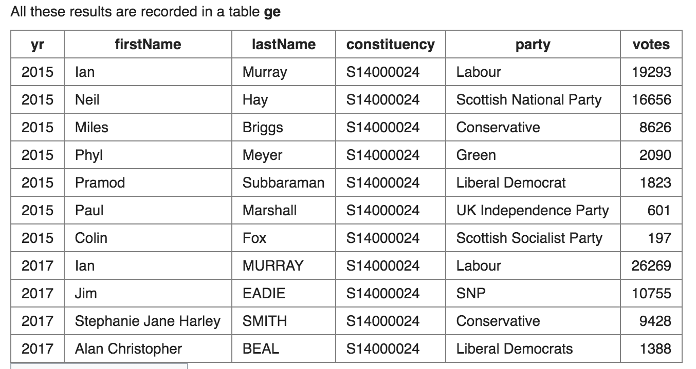

## 10. Numeric Examples



1.Show the lastName, party and votes for the constituency 'S14000024' in 2017.
```sql
SELECT lastName, party, votes
  FROM ge
 WHERE constituency = 'S14000024' AND yr = 2017
ORDER BY votes DESC;
```

2.You can use the RANK function to see the order of the candidates. If you RANK using (ORDER BY votes DESC) then the candidate with the most votes has rank 1.
Show the party and RANK for constituency S14000024 in 2017. List the output by party
```sql
SELECT party, votes,
       RANK() OVER (ORDER BY votes DESC) as posn
  FROM ge
 WHERE constituency = 'S14000024' AND yr = 2017
ORDER BY party;
```

3.The 2015 election is a different PARTITION to the 2017 election. We only care about the order of votes for each year.
Use PARTITION to show the ranking of each party in S14000021 in each year. Include yr, party, votes and ranking (the party with the most votes is 1).
```sql
SELECT yr,party, votes,
      RANK() OVER (PARTITION BY yr ORDER BY votes DESC) as posn
  FROM ge
 WHERE constituency = 'S14000021'
ORDER BY party, yr;
```

4.Edinburgh constituencies are numbered S14000021 to S14000026.
Use PARTITION BY constituency to show the ranking of each party in Edinburgh in 2017. Order your results so the winners are shown first, then ordered by constituency.
```sql
SELECT constituency,party, votes,
  RANK() OVER (PARTITION BY constituency ORDER BY votes DESC) as posn
  FROM ge
 WHERE constituency BETWEEN 'S14000021' AND 'S14000026'
   AND yr  = 2017
ORDER BY posn, constituency;
```

5.You can use SELECT within SELECT to pick out only the winners in Edinburgh.
Show the parties that won for each Edinburgh constituency in 2017.
```sql
SELECT constituency, party
FROM ( SELECT constituency, party, RANK() OVER (PARTITION BY constituency ORDER BY votes DESC) as table1
       FROM ge 
       WHERE constituency BETWEEN 'S14000021' AND 'S14000026'
              AND yr  = 2017
     ) x 
WHERE x.table1 = 1;
```

6.You can use COUNT and GROUP BY to see how each party did in Scotland. Scottish constituencies start with 'S'
Show how many seats for each party in Scotland in 2017.
```sql
SELECT party, COUNT(constituency)
FROM (
  SELECT constituency, party, RANK() OVER (PARTITION BY constituency ORDER BY votes DESC) as table1
  FROM ge 
  WHERE constituency LIKE 'S%'
          AND yr  = 2017
) x 
  WHERE x.table1 = 1
  GROUP BY party;
```
